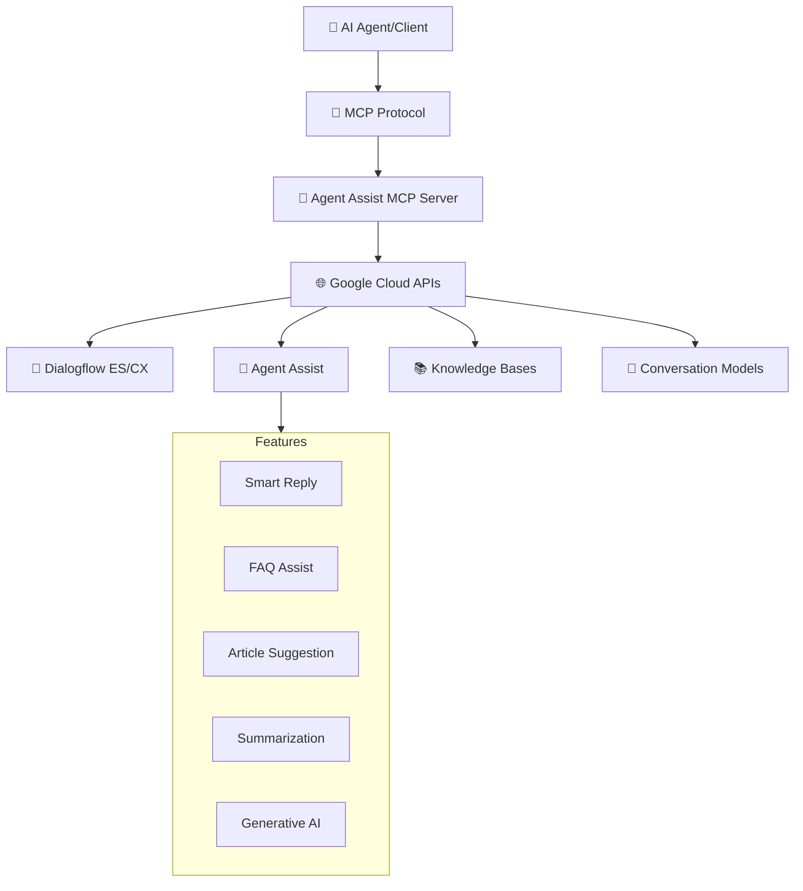

# Google Agent Assist MCP Server 🤖💬

[](https://smithery.ai/server/@your-org/google-agent-assist-mcp)


## 📋 Overview

A comprehensive **Model Context Protocol (MCP)** server for **Google Agent Assist** that provides access to all Agent Assist features through a unified interface. This server enables AI agents to leverage Google's powerful conversation AI capabilities for customer support, including real-time suggestions, knowledge management, and conversation analysis.

## 🌟 Features

### Core Capabilities

| Feature Category | Description | Status |
|-----------------|-------------|--------|
| 💬 **Conversation Management** | Create, list, and manage conversations | ✅ Ready |
| 👤 **Conversation Profiles** | Configure suggestion parameters and AI behaviors | ✅ Ready |
| 🤝 **Participants** | Manage conversation participants and analyze content | ✅ Ready |
| 📚 **Knowledge Bases** | Create and manage knowledge repositories | ✅ Ready |
| 💡 **Smart Reply** | AI-powered response suggestions | ✅ Ready |
| 📄 **Article Suggestions** | Real-time document recommendations | ✅ Ready |
| ❓ **FAQ Assist** | Automated FAQ suggestions | ✅ Ready |
| 📝 **Summarization** | AI-generated conversation summaries | ✅ Ready |
| 🧠 **Generative AI** | Advanced generative features | ✅ Ready |
| 📊 **Analytics & Feedback** | Track performance and collect feedback | ✅ Ready |

### Detailed Feature List

#### 🔹 Conversation Management
- Create new conversations with custom profiles
- List and filter active conversations
- Complete conversations
- Track conversation lifecycle states

#### 🔹 Conversation Profiles
- Create profiles with human agent assistant configurations
- Configure suggestion types (Smart Reply, FAQ, Articles)
- Set confidence thresholds and max results
- Configure automated agent settings
- Enable notification configurations

#### 🔹 Real-time Analysis
- Analyze text, audio, or event inputs
- Get real-time suggestions for agents
- Support for partial automated replies
- Message sentiment and entity extraction

#### 🔹 Knowledge Management
- Create and manage knowledge bases
- Upload documents (FAQ, articles, extractive Q&A)
- Support for multiple document types
- Metadata management
- Search across knowledge bases

#### 🔹 Smart Reply
- Train custom conversation models
- Manage conversation datasets
- Deploy and undeploy models
- Allowlist management
- Model performance monitoring

#### 🔹 Suggestion Features
- Article suggestions from knowledge bases
- FAQ suggestions for common questions
- Smart reply suggestions
- Generative knowledge assist
- Proactive suggestions based on context

#### 🔹 Advanced Features
- Conversation summarization with Gemini models
- Answer record feedback collection
- Multi-language support (13+ languages)
- Voice transcription capabilities
- Pub/Sub notifications

## 🏗️ Architecture



## 🚀 Quick Start

### Prerequisites 📋
- 🐍 Python 3.12+
- 🔑 Google Cloud Project with Agent Assist API enabled
- 📄 Service Account with necessary permissions
- 💳 Billing enabled on Google Cloud Project

### Required Google Cloud APIs
Enable these APIs in your Google Cloud Console:
- Dialogflow API
- Agent Assist API
- Cloud Storage API (for document storage)
- Cloud Pub/Sub API (for notifications)

### Service Account Permissions
Your service account needs these roles:
- `roles/dialogflow.admin`
- `roles/dialogflow.consoleAgentEditor`
- `roles/dialogflow.reader`

### Installation 💾

```bash
# Clone the repository
git clone https://github.com/your-org/google-agent-assist-mcp-server.git
cd google-agent-assist-mcp-server

# Install dependencies
pip install -e .
```

### Configuration 🔧

1. **Create a Service Account**:
```bash
gcloud iam service-accounts create agent-assist-mcp \
    --display-name="Agent Assist MCP Server"
```

2. **Grant Permissions**:
```bash
gcloud projects add-iam-policy-binding YOUR_PROJECT_ID \
    --member="serviceAccount:agent-assist-mcp@YOUR_PROJECT_ID.iam.gserviceaccount.com" \
    --role="roles/dialogflow.admin"
```

3. **Download Service Account Key**:
```bash
gcloud iam service-accounts keys create service-account-key.json \
    --iam-account=agent-assist-mcp@YOUR_PROJECT_ID.iam.gserviceaccount.com
```

## 🎮 Available Commands

### Initialization

#### `initialize_agent_assist`
Initialize the Agent Assist client with credentials.

```python
{
    "service_account_json": "{...}",  # Service account JSON content
    "project_id_input": "my-project-id",
    "location": "global"  # Optional, default: "global"
}
```

### Conversation Management

#### `create_conversation`
Create a new conversation.

```python
{
    "conversation_profile_id": "profile-123",
    "conversation_id": "custom-id"  # Optional
}
```

#### `list_conversations`
List all conversations with optional filtering.

```python
{
    "page_size": 100,
    "page_token": "next-page-token",  # Optional
    "filter_str": "lifecycle_state=IN_PROGRESS"  # Optional
}
```

#### `complete_conversation`
Mark a conversation as completed.

```python
{
    "conversation_id": "conversation-123"
}
```

### Conversation Profiles

#### `create_conversation_profile`
Create a conversation profile with AI configurations.

```python
{
    "display_name": "Customer Support Profile",
    "language_code": "en-US",
    "time_zone": "America/New_York",
    "human_agent_assistant_config": {
        "human_agent_suggestion_config": {
            "feature_configs": [
                {
                    "type": "ARTICLE_SUGGESTION",
                    "query_config": {
                        "knowledge_base_query_source": {
                            "knowledge_bases": ["projects/.../knowledgeBases/kb-123"]
                        }
                    },
                    "max_results": 3,
                    "confidence_threshold": 0.7
                }
            ]
        }
    }
}
```

### Participant Management

#### `create_participant`
Add a participant to a conversation.

```python
{
    "conversation_id": "conversation-123",
    "role": "END_USER",  # or "HUMAN_AGENT", "AUTOMATED_AGENT"
    "user_id": "user-456"  # Optional
}
```

#### `analyze_content`
Analyze participant input and get AI suggestions.

```python
{
    "participant_id": "projects/.../participants/participant-123",
    "text_input": "How do I reset my password?",
    "request_id": "unique-request-id",  # Optional for idempotency
    "enable_partial_automated_agent_reply": false
}
```

### Knowledge Management

#### `create_knowledge_base`
Create a knowledge base for documents.

```python
{
    "display_name": "Product Documentation",
    "language_code": "en-US"
}
```

#### `create_document`
Add a document to a knowledge base.

```python
{
    "knowledge_base_id": "kb-123",
    "display_name": "Password Reset Guide",
    "mime_type": "text/html",
    "knowledge_types": ["FAQ", "ARTICLE_SUGGESTION"],
    "content_uri": "gs://bucket/password-reset.html",
    "metadata": {
        "category": "authentication",
        "last_updated": "2024-01-01"
    }
}
```

### Smart Reply

#### `create_conversation_model`
Train a Smart Reply model.

```python
{
    "display_name": "Customer Support Model",
    "datasets": ["dataset-123", "dataset-456"],
    "language_code": "en-US"
}
```

#### `deploy_conversation_model`
Deploy a trained model.

```python
{
    "model_id": "model-123"
}
```

### Feedback Collection

#### `update_answer_record`
Provide feedback on suggestions.

```python
{
    "answer_record_id": "projects/.../answerRecords/record-123",
    "clicked": true,
    "displayed": true,
    "correctness_level": "FULLY_CORRECT",
    "feedback_details": {
        "custom_rating": 5
    }
}
```

### Search and Discovery

#### `search_knowledge`
Search knowledge bases for answers.

```python
{
    "query": "password reset steps",
    "conversation_profile_id": "profile-123",
    "conversation_id": "conversation-456",  # Optional
    "query_source": "AGENT_QUERY"
}
```

### Summarization

#### `generate_conversation_summary`
Generate AI summary of a conversation.

```python
{
    "conversation_id": "conversation-123",
    "profile_id": "profile-with-summary-config"  # Optional
}
```

## 📝 Usage Examples

### Complete Customer Support Flow

```python
# 1. Initialize the server
mcp.initialize_agent_assist(
    service_account_json=SERVICE_ACCOUNT_JSON,
    project_id_input="my-project"
)

# 2. Create a conversation profile
profile = mcp.create_conversation_profile(
    display_name="Support Profile",
    human_agent_assistant_config={
        "human_agent_suggestion_config": {
            "feature_configs": [
                {
                    "type": "SMART_REPLY",
                    "max_results": 3,
                    "confidence_threshold": 0.1
                },
                {
                    "type": "FAQ",
                    "query_config": {
                        "knowledge_base_query_source": {
                            "knowledge_bases": [kb_name]
                        }
                    },
                    "confidence_threshold": 0.4
                }
            ]
        }
    }
)

# 3. Create a conversation
conversation = mcp.create_conversation(
    conversation_profile_id=profile["conversation_profile"]["name"].split("/")[-1]
)

# 4. Add participants
end_user = mcp.create_participant(
    conversation_id=conversation["conversation"]["name"].split("/")[-1],
    role="END_USER"
)

agent = mcp.create_participant(
    conversation_id=conversation["conversation"]["name"].split("/")[-1],
    role="HUMAN_AGENT"
)

# 5. Analyze customer message
analysis = mcp.analyze_content(
    participant_id=end_user["participant"]["name"],
    text_input="I forgot my password and can't log in"
)

# 6. Get suggestions for agent
print("Smart Reply Suggestions:", analysis.get("human_agent_suggestions"))

# 7. Complete conversation and generate summary
mcp.complete_conversation(conversation_id=conversation["conversation"]["name"].split("/")[-1])
summary = mcp.generate_conversation_summary(
    conversation_id=conversation["conversation"]["name"].split("/")[-1]
)
```

## 🌐 Supported Languages

Agent Assist supports the following languages:

- 🇺🇸 English (US) - `en-US`
- 🇬🇧 English (UK) - `en-GB`
- 🇪🇸 Spanish (Spain) - `es-ES`
- 🌎 Spanish (Latin America) - `es-419`
- 🇫🇷 French - `fr-FR`
- 🇩🇪 German - `de-DE`
- 🇮🇹 Italian - `it-IT`
- 🇧🇷 Portuguese (Brazil) - `pt-BR`
- 🇳🇱 Dutch - `nl-NL`
- 🇯🇵 Japanese - `ja-JP`
- 🇰🇷 Korean - `ko-KR`
- 🇨🇳 Chinese (Simplified) - `zh-CN`
- 🇹🇼 Chinese (Traditional) - `zh-TW`

## 📊 Performance Best Practices

1. **Conversation Profiles**: Create specific profiles for different use cases
2. **Confidence Thresholds**: 
   - Smart Reply: 0.01 (very low for more suggestions)
   - Article Suggestion: 0.44
   - FAQ Assist: 0.4
3. **Knowledge Base Organization**: Group related documents in separate KBs
4. **Model Training**: Use at least 30,000 conversations for Smart Reply
5. **Feedback Loop**: Always update answer records to improve suggestions

## 🔒 Security Considerations

- Store service account credentials securely
- Use least privilege principle for permissions
- Enable audit logging in Google Cloud
- Regularly rotate service account keys
- Monitor API usage and quotas

## 🧪 Testing

### Unit Tests
```bash
pytest tests/
```

### Integration Tests
```bash
pytest tests/integration/ --integration
```

### Manual Testing with MCP Inspector
```bash
# Start the server
python main.py

# In another terminal
npx @modelcontextprotocol/inspector
```

## 📁 Project Structure

```
google-agent-assist-mcp-server/
├── 📄 main.py                 # Main MCP server implementation
├── 📋 pyproject.toml         # Project configuration
├── 📖 README.md              # This file
├── 🐳 Dockerfile             # Container configuration
├── 📄 smithery.yaml          # Smithery deployment config
├── 📁 tests/                 # Test suite
│   ├── test_conversations.py
│   ├── test_profiles.py
│   ├── test_knowledge.py
│   └── test_suggestions.py
└── 📁 examples/              # Usage examples
    ├── customer_support.py
    ├── knowledge_import.py
    └── model_training.py
```

## 🤝 Contributing

1. Fork the repository
2. Create a feature branch (`git checkout -b feature/amazing-feature`)
3. Commit your changes (`git commit -m 'Add amazing feature'`)
4. Push to the branch (`git push origin feature/amazing-feature`)
5. Open a Pull Request

### Development Setup

```bash
# Install dev dependencies
pip install -e ".[dev]"

# Run linting
black .
isort .
flake8 .

# Run tests
pytest -v
```

## 📄 License

This project is licensed under the **Apache License 2.0** - see the [LICENSE](LICENSE) file for details.

## 🔗 Resources

| Resource | URL | Description |
|----------|-----|-------------|
| 📚 **Agent Assist Docs** | [cloud.google.com/agent-assist](https://cloud.google.com/agent-assist/docs) | Official documentation |
| 🔧 **Dialogflow ES API** | [Dialogflow Reference](https://cloud.google.com/dialogflow/es/docs/reference) | API reference |
| 💬 **MCP Protocol** | [modelcontextprotocol.io](https://modelcontextprotocol.io) | Protocol specification |
| 🏗️ **Smithery** | [smithery.ai](https://smithery.ai) | MCP server registry |

## 🆘 Support

Need help? Here are your options:

- 📧 **Email**: support@your-org.com
- 🐛 **Issues**: [GitHub Issues](https://github.com/your-org/google-agent-assist-mcp/issues)
- 💬 **Discussions**: [GitHub Discussions](https://github.com/your-org/google-agent-assist-mcp/discussions)
- 📖 **Google Cloud Support**: [cloud.google.com/support](https://cloud.google.com/support)

## 🎉 Acknowledgments

- 🙏 **Google Cloud** for Agent Assist and Dialogflow
- ⚡ **Anthropic** for the Model Context Protocol
- 🌟 **Community** for contributions and feedback

---

<div align="center">

**🚀 Empower your customer support with AI-powered assistance! 🚀**

</div>
